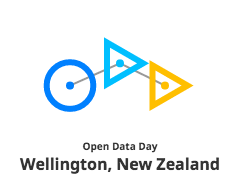

# International Open Data Day 2017 - Wellington

Data.govt.nz are proud to be a part of this years Open Data Day hosted at the National Library of New Zealand's Net.work space on Saturday, 4th March 2017 (mark it in your calendar now!). This is an annual celebration of open data all over the world. For the 5th time in history, groups around the globe will create local events on this day as they use open data in their communities. It is an opportunity to show the benefits of open data & encourage the adoption of open data policies in government, business and civil society.

Because Kiwis love our nature, the mini-hack day this year will be focused on environmental data.

For some ideas of what that might look like, check out http://opendataday.org/#resources.

## Team projects
 - [Eascape routes](EscapeRoutes/Readme.md) - Concept for an application that shows official evacuation routes in the event of an earthquake or tsunami overlaid with local crowd sourced routes.

## What you need to know

 - 4th March 2017, starts at 9am until 4:30pm
 - Hosted at the [National Library](https://www.google.co.nz/maps/place/National+Library/@-41.2768239,174.7757755,17z/data=!3m1!4b1!4m5!3m4!1s0x6d38ae2948146487:0xa3762b6d3b3e919c!8m2!3d-41.2768239!4d174.7779642), [Net.work space](https://natlib.govt.nz/visiting/wellington/network)
 - [Code of conduct](http://govhack.org.nz/resources/code-of-conduct/ ) (we are using the GovHack one, please respect this and your fellow open data hackers)
 - Meet in the foyer in the morning for welcome and health & safety briefing.
 - WIFI access point is "Free Library Wi-Fi", password is "wellington". You'll need to agree to the Terms of use.
 - Please no food or drinks without lids in the Net.work space (Home cafe is near by and there is a nice outside space too)
 - The theme is "environment" so see what environment data you can find and use.
 - Raise any questions and feedback through [GitHub issues](https://github.com/data-govt-nz/odd17/issues/new)
 
## Some data sources you might like to use for open dataday

 - http://www.stats.govt.nz/browse_for_stats/environment/environmental-reporting-series/environmental-indicators/Home.aspx
 - https://data.mfe.govt.nz/tables/category/environmental-reporting/
 - [Data.govt.nz - Environment and conservation datasets](https://data.govt.nz/search?q=&CategoryID=8)
 - [Landcare Research datastore](https://datastore.landcareresearch.co.nz/)
 - [LINZ Data service](https://data.linz.govt.nz/)
 - [Greater Wellington Selected Land Use Register (locations where hazardous substances are)](http://mapping.gw.govt.nz/arcgis/rest/services/GW/Our_Environment_P/MapServer/39/)
 - [Department of Conservation APIs (Huts and Campsites)](http://www.doc.govt.nz/api)
 - [Department of Conservation Geospatial data portal](http://geoportal.doc.govt.nz/geoportal/catalog/main/home.page)
 - [Department of Conservation API - Regions](http://www.doc.govt.nz/api/profiles/regions)
 - [Department of Conservation API - Walks](http://www.doc.govt.nz/api/profiles/walks)
 - [Department of Conservation API - MTB Tracks](http://www.doc.govt.nz/api/profiles/cycling)
 - [Department of Conservation API - Lodges](http://www.doc.govt.nz/api/profiles/lodges)
 - [Department of Conservation API - Parks](http://www.doc.govt.nz/api/profiles/parks)

 Add any others by creating a [GitHub account](https://github.com/join), [editing this page](https://github.com/data-govt-nz/odd17/edit/master/README.md).

## Agenda for the day
 - 9am Meet in the foyer conference room - Welcome, health and safety breifing and a few words from sponsors
 - 9:15am Team forming, brainstorm ideas and problems
 - 9:35am/9:45am - Start hacking on projects or learning new things about open data
 - 10:30am - Morning tea
 - 11:00am - Hack some more
 - 12:30pm - LUNCH
 - 1:00pm - More hacking & videographer arrives to document our open data day (you can opt out of this)
 - 4:00pm - Back to the foyer conference room to show off the hacks
 - 4:30pm - Finsh up, tidy up

## Getting help on the day
We'll make use og GitHub issues to track Q & A for data use, data frustrations (we'll also have an in person help desk for this too). To use, sign up for a GitHub account and then [open an issue you're having](https://github.com/data-govt-nz/odd17/issues/new).

Be sure to keep an eye on this area too as you may be able to help others!

### Getting your project underway
Sometimes it can help to do some quick planning for your hack project. We suggest giving a [Lean Canvas](http://socialleancanvas.com/) a go to help with your thought process. It's a simple 1 page plan that gives you enough to get moving on an idea. Give it a try.

## Big thanks to
 - [data.govt.nz](http://www.data.govt.nz)
 - [GovHackNZ](http://govhack.org.nz/)
 - [Open Data NZ](https://www.data.govt.nz/toolkit/open-data-in-new-zealand/open-data-nz/)
 - [National Library of New Zealand](https://natlib.govt.nz/)
 - [Statistics New Zealand](http://www.stats.govt.nz/)
 - all the mentors and hackers!

## Sneak peak
Congrats you read all the stuff - here's a reward, [sneak peak of the forthcoming new data.govt.nz open data portal](https://dia-ckan-staging-new.catalyst.net.nz/dataset). We're busy loading in more datasets from agencies all over central, local and regional government, [we'd love your feedback](mailto:info@data.govt.nz).
